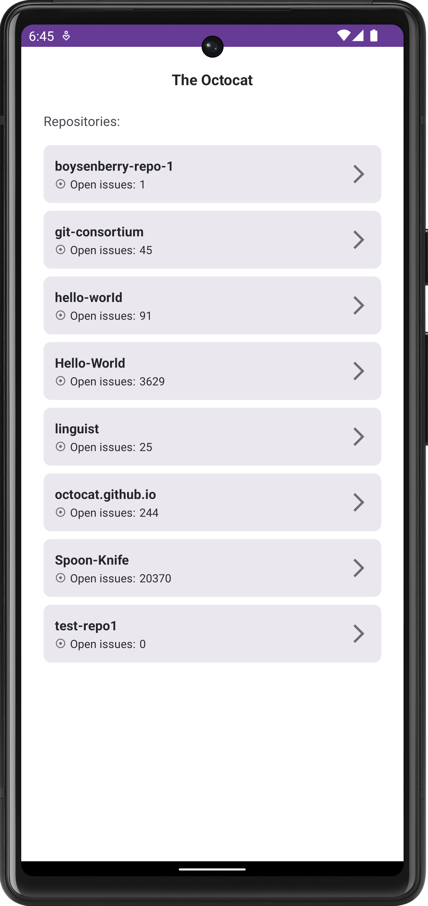
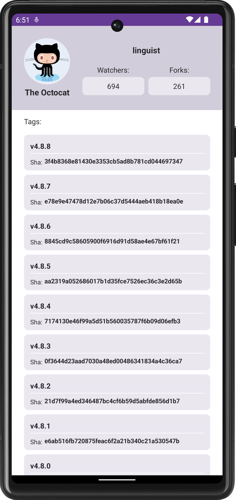
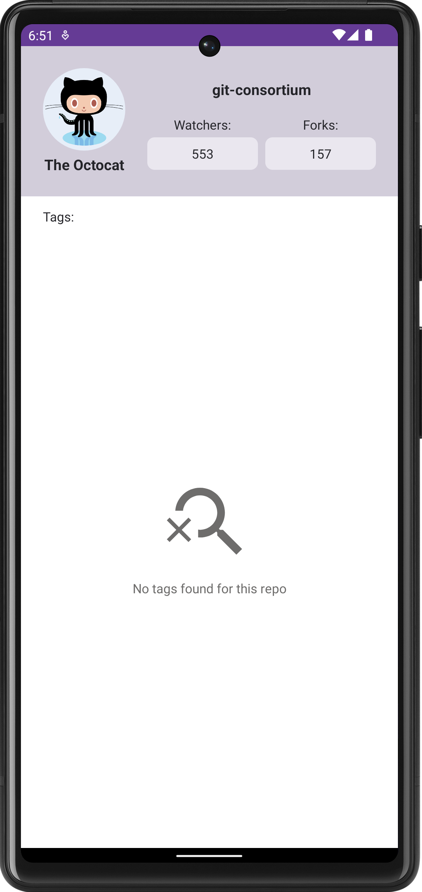
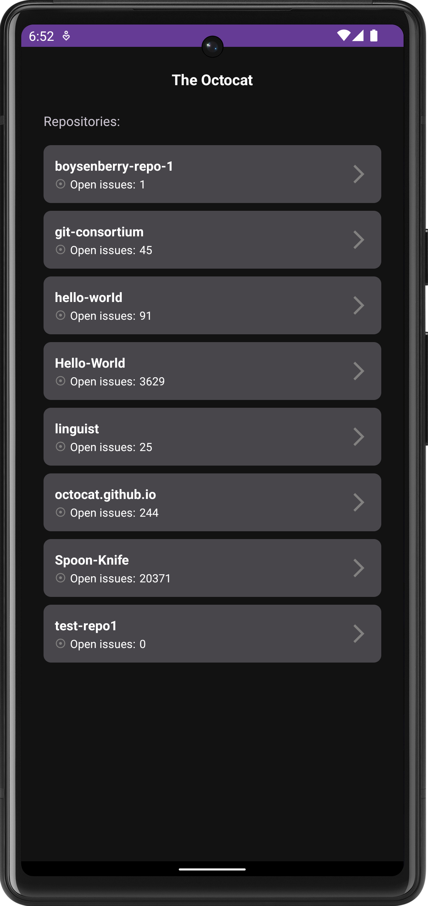
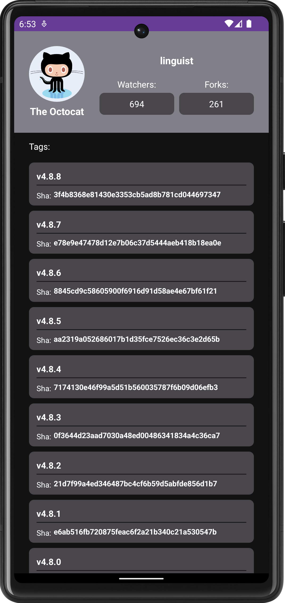

# Github User Repos App
An Android application that displays public repositories for the user "Octocat". This is a clean, simple app built using the **MVVM architecture**.

## Key Libraries and Concepts

* **Kotlin Coroutines & Flow** – For reactive programming and asynchronous data fetching without blocking the UI thread.
* **MVVM Architecture** – Clear separation of business logic from the user interface.
* **Koin** – Dependency Injection (DI) framework for managing dependencies and improving code testability.
* **Retrofit & OkHttp** – For robust communication with the GitHub REST API.
* **Navigation Component** – For declarative fragment-to-fragment navigation.
* **View Binding** – Used to safely interact with UI components
* **Light/Dark theme support** - Fully implemented using a centralized color system for better accessibility.

## Screenshots

     
     
     
     
     

